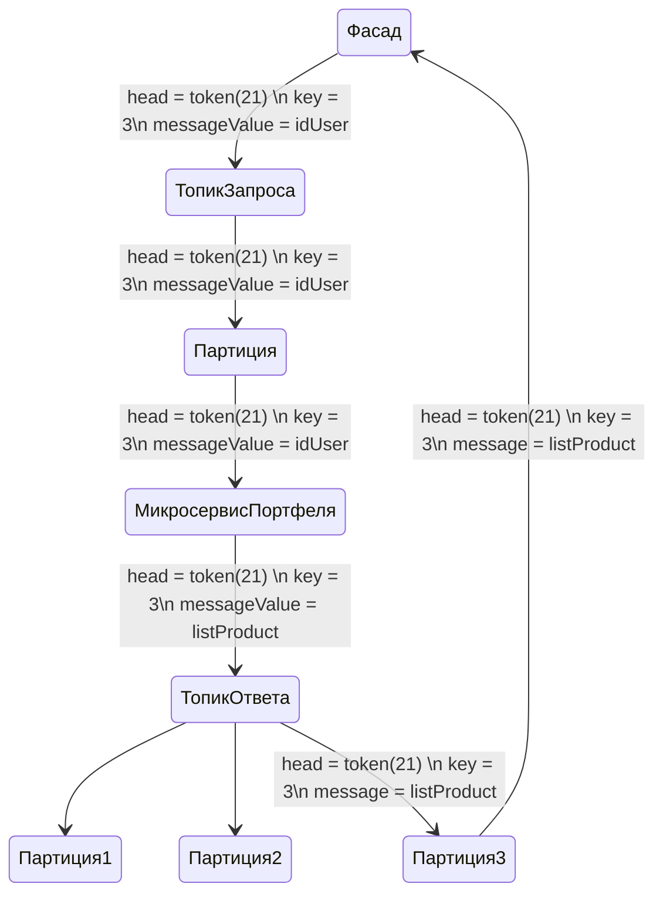

### Проблема:
  Решение о взаимодействие фасада с другими микросервисами по grpc вызывает вопросы:  
  - Общение напрямую через grpc вызывает несостыковки в общей архитектуре.  
  
  
### Решение:  
  Описание логики взаимодействий:  
Все сообщения, в том числе от фасада и к фасаду, будут идти через Kafka.  
Предполагается следующее взаимодействие:  
Для запросов данных, мы формируем два топика. Один топик для сообщения ответа, откуда читать будем. Другой топик для сообщения, чтобы нам сформировали данные.  
  
Абстрактная схема:  

Запрос приходит в один топик, в одну партицию (опционально), откуда на конкурентной основе, сообщения будут разбирать консюмеры.  

Сообщение состоит из header key messageValue  
header будет хранить в себе следующую конструкцию (key = токен, value = null)  
где токен будет уникальная случайная строка.  
header Будет отвечать за указатель, кому это сообщение адресовано. Сервисы будет ждать ответы только с header  и токеном который они сами сгенерировали для себя.  
key будет отвечать за то, в какую партицию будет доставлен ответ, на эту партицию и будем формировать консюмер.  
messageValue хранит тело сообщения
Например там могут быть idUser для запроса списка продуктов.  
А ответное MessageValue, будет состоять из товаров по этому IdUser. 

Можно предположить стандартное кол партиций 5. Для топика который будет содержать ответ. 

  
### Проблема:
 - Сбор правил взаимодействия между сервисами по нескольким адр вызывает конфликты и недопонимание.  
  
  
### Решение:  
  [Доска взаимодействий](https://miro.com/app/board/uXjVOiQGoYc=/?share_link_id=112559324980)  

  
