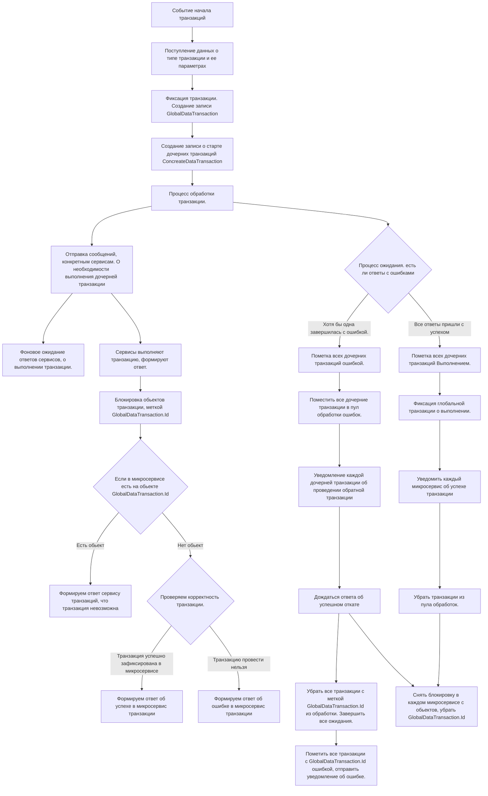


## Context: 
Миксервис контролирующий целостность транзакций. 

## Decision

Основной алгоритм транзакции описан в диаграмме.
# Transaction Service

Краткая суть. 
В микросервис транзакции приходит событие, провести определенный тип транзакции, по таким то полям. 
Микросервис формирует 
GlobalDataTransaction{
	Id
	TypeTransaction
	IsCompleted
	IsError
	CreateData
}
и дочерние обьекты 
ConcreateDataTransaction{
	IdGlobalTransaction
	TargetServis
	IsComplited
	IsError
	CreateData
	Details of the operation in progress {Данные}
}

GlobalDataTransaction используется как всеобщая метка о транзакции, используется во всех микросервисах.
На примере микросервиса счета.

Приходит сообщение о необходимости выполнения транзакции между двумя счетами. 
Проводим мипросервис счета(Баланс) проводит транзакцию внутри себя между двумя счетами.
Помечаем счет А и счет B, меткой GlobalDataTransaction.Id
Она означает, что обьект А, в процессе транзакции с таким то Id.
Уведомляем микросервис транзакции, что операция проведена успешно. 
Переодически опрашиваем микросервис транзакции, о состоянии транзакции с меткой GlobalDataTransaction.Id, и дожидаемся ответа. 
В какой то момент времени, ответ будет получен. 
Если ответ что GlobalDataTransaction.Id зафиксирована. То освобождаем обьект А и обьект B от метки транзакций. 
операция зафиксированна. 

#События входящие
Используется псевдокод

Проверить статус транзакции {
	GlobalDataTransaction.Id
}

Подтвердить статус дочерней транзакции {
	string транзакция/откат
	bool статус
	GlobalDataTransaction.Id
}

Пополнить баланс {
	guid id 
	guid idUser
	string источник
	Double count
}

Перевод перевод средств между двумя лицами{
	guid id
	guid idUserOut
	guid idUserFrom
	string typeMoney
	Double count
}

Событие покупки товара {
	guid id
	guid idЗаявки
	guid idUserOut
	guid idUserFrom
	guid айдидовара
	int количество товара
	Double сумма сделки
}

#События исходящие
Пополнить баланс {
	guid id 
	GlobalDataTransaction.Id
	guid idUser
	string источник
	Double count
}
Перевод перевод средств между двумя лицами{
	guid id
	GlobalDataTransaction.Id
	guid idUserOut
	guid idUserFrom
	string typeMoney
	Double count
}

перемещение товара{
	guid id
	guid idЗаявки
	GlobalDataTransaction.Id
	guid idUserOut
	guid idUserFrom
	guid айдидовара
	int количество товара
}

Статус транзакции {
	GlobalDataTransaction.Id
	string статус
}

## Status

Предложено

## Context: 
Взаимодействие с kafka

## Decision

Вижу следующие варианты взаимодействие. 

Односторонние события. 
Продюсер формирует события. 
одно событие читается одним консюмером. 
Если читать одно событие одним консюмером, и помечать событие, если его выполнили.
То мы улучшаем скорость работу и обработки данных. 

Проблема 
Проблема в отсутствии возможности оперативного двустороннего общения. 

Возможные решения. 
Мы можем формировать ответное одностороннее сообщение. 
Проблема этого подхода заключается в том, что сообщение ожидает определенный консюмер. 
И нам нужно гарантировать доставку. а значит читают и обрабатывают его все. И консюмер на сервисной части кеширует код, чтобы по ID узнать что сообщение ему. 
Проблема заключается в количестве данных, это будет сильно нагружать систему. Данные избыточны, так как они нужны одному из всех. 
Если и данных передавать будем много. Например тысячи колекций предметов. То это самый настоящий дедос. 

Мы можем попытаться общаться на прямую, сервис - сервис. оставляя на kafka общение которое требует изменение состояния системы. 
а передачу данных, делать сервис - сервис. 

Мы можем попытаться передавать уникальную систему в событии. 
В событии, будет адрес куда отдать пакет данных. сервер/сессия, или точнее с подпиской на событие в классе, о выполнении события в консюмере. 
консюмер сформирует оперативный ответ, который будет доставлен точечно. 
Это из области фантазий что было бы хорошо в этом мире. 

Мы можем попытатьяс динамически создавать временные топики так же как и временный продюсер и консюмер. 
Статический продюсер создает событие. 
создает топик лично для него, в который будет положен ответ. и подписывается на него
в статический топик отправляется событие с адресом топика для обратной связи.
первый попавшийся консюмер обрабатывает событие. 
Создает временный продюсер для ответа, в временный топик. 
Формирует ответ для одного единственного консюмера. 
Временный консюмер читает данные из временного топика, которые созданы лично для него. 
из плюсов
Так мы не создаем нагрузку на общие каналы связи по топикам и консюмеров которые читать будут. 
И мы удобнее распаралелим наргруку, когда 1 событие обрабатывается только одним консюмером на конкурентной основе. кто первый взял. 
Из минусов
нагрузку на kafka по генерации и уничтожении обьектов топиков, продюсеров, консюмеров. 

## Status

Предложено