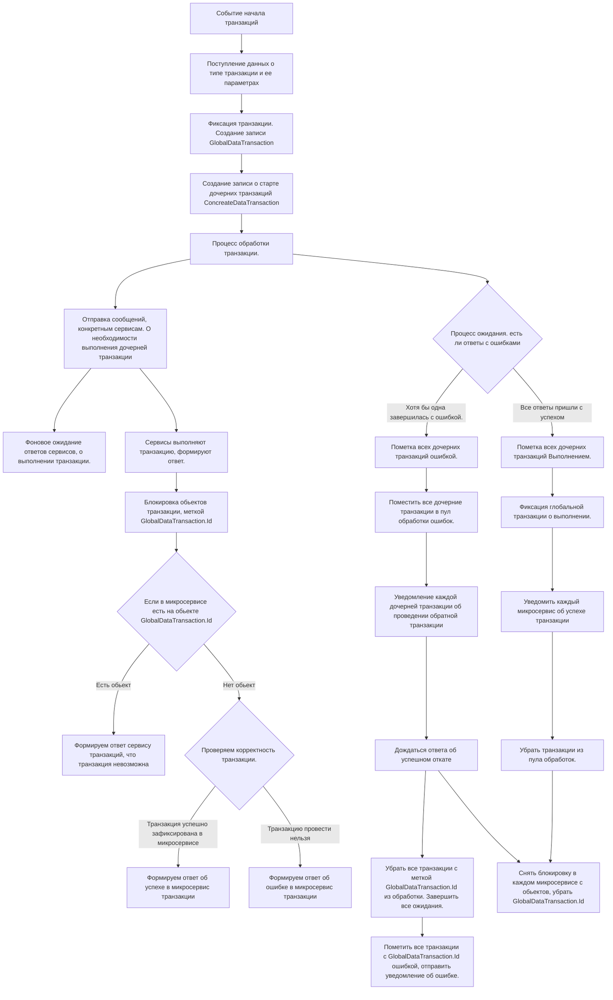
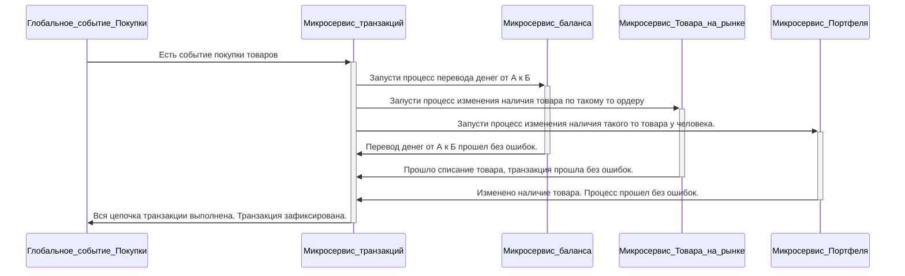
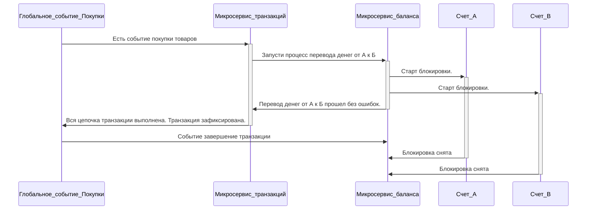
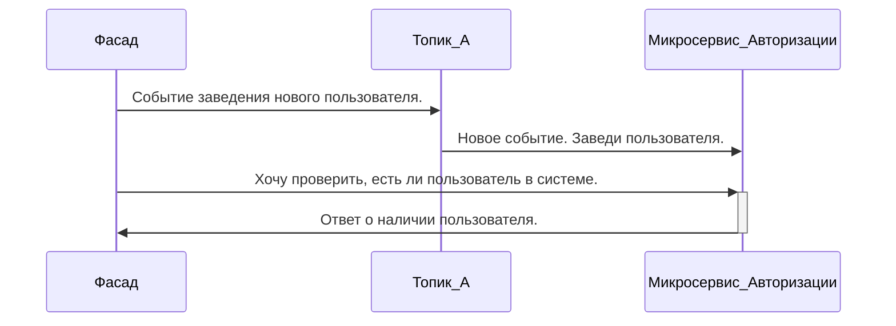


# Context: 
Миксервис контролирующий целостность транзакций. 

# Decision

Основной алгоритм транзакции описан в диаграмме.
## Transaction Service

## Краткая суть. 
В микросервис транзакции приходит событие, провести определенный тип транзакции, по таким то полям. 
Микросервис формирует 
GlobalDataTransaction{

	Id
	
	TypeTransaction
	
	IsCompleted
	
	IsError
	
	CreateData
	
}
и дочерние обьекты 
ConcreateDataTransaction{

	IdGlobalTransaction
	
	TargetServis
	
	IsComplited
	
	IsError
	
	CreateData
	
	Details of the operation in progress {Данные}
	
}

GlobalDataTransaction используется как всеобщая метка о транзакции, используется во всех микросервисах.
## Схема связи сервисов
Вариант "запусти процесс" может быть реализован через события, или общение сервис-сервис

### На примере микросервиса счета.

Приходит сообщение о необходимости выполнения транзакции между двумя счетами. 
Проводим мипросервис счета(Баланс) проводит транзакцию внутри себя между двумя счетами.
Помечаем счет А и счет B, меткой GlobalDataTransaction.Id
Она означает, что обьект А, в процессе транзакции с таким то Id.
Уведомляем микросервис транзакции, что операция проведена успешно. 
Переодически опрашиваем микросервис транзакции, о состоянии транзакции с меткой GlobalDataTransaction.Id, и дожидаемся ответа. 
В какой то момент времени, ответ будет получен. 
Если ответ что GlobalDataTransaction.Id зафиксирована. То освобождаем обьект А и обьект B от метки транзакций. 
операция зафиксированна.  
#### Пример блокировки на примере сервиса баланса

# События входящие
Используется псевдокод grpc
Типы данных возможных enum типов. Представлены в виде примитива String

(Событие которое сообщает, что нужны данные о статусе транзакции) {

	GlobalDataTransaction.Id
	
}

(Событие которое сообщает, что нужны данные о дочерней транзакции) {

	string транзакция/откат
	
	GlobalDataTransaction.Id
}

Пополнить баланс {

	guid id 
	
	guid idUser
	
	Double count //Проблемы плавающих точек описаны ниже.
}

Перевод перевод средств между двумя лицами{

	guid id
	
	guid idUserOut
	
	guid idUserFrom
	
	Double count //Проблемы плавающих точек описаны ниже.
}

Событие покупки товара {

	guid id
	
	guid idЗаявки
	
	guid idUserOut
	
	guid idUserFrom
	
	guid айдидовара
	
	int количество товара
	
	Double сумма сделки //Проблемы плавающих точек описаны ниже.
}

# События исходящие

Пополнить баланс {

	guid id 
	
	GlobalDataTransaction.Id
	
	guid idUser
	
	Double count //Проблемы плавающих точек описаны ниже. 
}

Перевод перевод средств между двумя лицами{

	guid id
	
	GlobalDataTransaction.Id
	
	guid idUserOut
	
	guid idUserFrom
	
	Double count //Проблемы плавающих точек описаны ниже.
}

перемещение товара{

	guid id
	
	guid idЗаявки
	
	GlobalDataTransaction.Id
	
	guid idUserOut
	
	guid idUserFrom
	
	guid айдидовара
	
	int количество товара
	
}

(Событие оповещающие о статусе транзакции) {
	GlobalDataTransaction.Id
	string статус
}
# Status

Предложено

# Context: 
Проблема операций вычисления плавающией точки

# Decision
Используемые технологии gRPC , mongoDB, .net 

## Проблема. 
gRPC используется как канал связи, с единым стандартом. Максимальная точность плавающей точки. Double
mongoDB Представлена как система хранения данных, максимально используемая точность плавающей точки Double. 

## Возможные решения.  
Первое решение это передавать и хранить данные в Double. А операции все с плавающей точкой проводить в decimal, либо в более точном типе данных, если кто найдет такой.  

### Плюсы
не накапливаются ошибки как в Double.  
### Минусы  
округление данных что рано или поздно снизит точность.  

## Решение второе.  

Использовать проекцию типов данных.   
использовать и передавать данные плавающей точки, в типах String или бинарно.  
При нужде использования, конвертируем в наиболее точный тип данных, которую может предоставить система. в .net это может быть decimal  

### Плюсы
позволит передавать неограниченную точность без потерь любого рода, до уровня которое позволяет дать система. Минуя ограничения по передаче и хранению.  

### Минусы  
неочевидность решения. 
сложности сопровождения. 
Затраты ресурсов на кастинг. 

# Status

Предложено 

# Context: 
Взаимодействие с kafka  

# Decision
 
Вижу следующие варианты взаимодействие.   
## Возможные решения. 
Односторонние события.  
Продюсер формирует события.  
одно событие читается одним консюмером.  
Если читать одно событие одним консюмером, и помечать событие, если его выполнили.  
То мы улучшаем скорость работу и обработки данных.   

### Проблема 
Проблема в отсутствии возможности оперативного двустороннего общения. 

#### Возможные решения. 
Мы можем формировать ответное одностороннее сообщение. 
Проблема этого подхода заключается в том, что сообщение ожидает определенный консюмер. 
И нам нужно гарантировать доставку. а значит читают и обрабатывают его все. И консюмер на сервисной части кеширует код, чтобы по ID узнать что сообщение ему. 
Проблема заключается в количестве данных, это будет сильно нагружать систему. Данные избыточны, так как они нужны одному из всех. 
#### Минусы
Если и данных передавать будем много. Например тысячи колекций предметов. То это самый настоящий дедос. 

##### Дополнительное пояснение к проблеме
Проще будет на примере. 
у нас есть Сервер. Сервер запускает программу в параллельном режиме. Что посетитель сайта может не ждать пока до него дойдет очередь обработки. 
Запускаются несколько экземпляров классов, которые обрабатывают запрос на получение данных. 
т.е это не последовательные вещи. 
Допустим у нас будет 100 экземпляров классов. 

События в kafka работают по принципу общего ведра. есть топик - ведро. Откуда может брать любой.  
Допустим наш сервер запрашивает данные по товарам пользователя.  

Подключений будет много. Все 100 экземпляров классов могут запрашивать по разным пользователям данные.  
Подключение под номером 52, запросило данные по "Петру Васильеву". 
Но все экземпляры сервера подписаны на одно ведро - топик.  

Все запрашиваемые данные. 100 экземпляров классов. будут лежать в топике.  
Чтобы узнать кому, какой пакет данных из топика. Каждый из 100 экземпляров классов, должен просмотреть каждый пакет данных. 
Сложность обработки равняется N^2  

https://www.logicbig.com/tutorials/misc/kafka/using-keys-for-partition-assignment.html 
Есть такое предложенное решение.  
Нужно смотреть возможно ли динамически создавать разделы.  
Либо обеспечивать конкурентное разделение разделов.  

## Возможные решения. 
Мы можем попытаться общаться на прямую, сервис - сервис. оставляя на kafka общение которое требует изменение состояния системы. 
а передачу данных, делать сервис - сервис. 

Мы можем попытаться передавать уникальную систему в событии. 

В событии, будет адрес куда отдать пакет данных. сервер/сессия, или точнее с подпиской на событие в классе, о выполнении события в консюмере. 

консюмер сформирует оперативный ответ, который будет доставлен точечно. 

Это из области фантазий что было бы хорошо в этом мире. 

### Один из вариантов решения. 
Использовать kafka только для сообщений изменения сосояния. В формате, требования изменить состояние либо уведомления об успешном изменении состояния. 

Для этого сервисы должны знать друг о друге, и иметь возможность общаться на прямую. 
#### Минусы. 
Очевидные препядствия для маштабирования. 
Увеличения связанности логики. 

## Возможные решения. 
Мы можем попытаться динамически создавать временные топики так же как и временный продюсер и консюмер. 

Статический продюсер создает событие. 

создает топик лично для него, в который будет положен ответ. и подписывается на него  

в статический топик отправляется событие с адресом топика для обратной связи.  

первый попавшийся консюмер обрабатывает событие. 

Создает временный продюсер для ответа, в временный топик. 

Формирует ответ для одного единственного консюмера. 

Временный консюмер читает данные из временного топика, которые созданы лично для него. 
### Плюсы  

Так мы не создаем нагрузку на общие каналы связи по топикам и консюмеров которые читать будут.
   
И мы удобнее распаралелим наргруку, когда 1 событие обрабатывается только одним консюмером на конкурентной основе. кто первый взял. 

### Минусы 

нагрузку на kafka по генерации и уничтожении обьектов топиков, продюсеров, консюмеров.  

# Status

Предложено