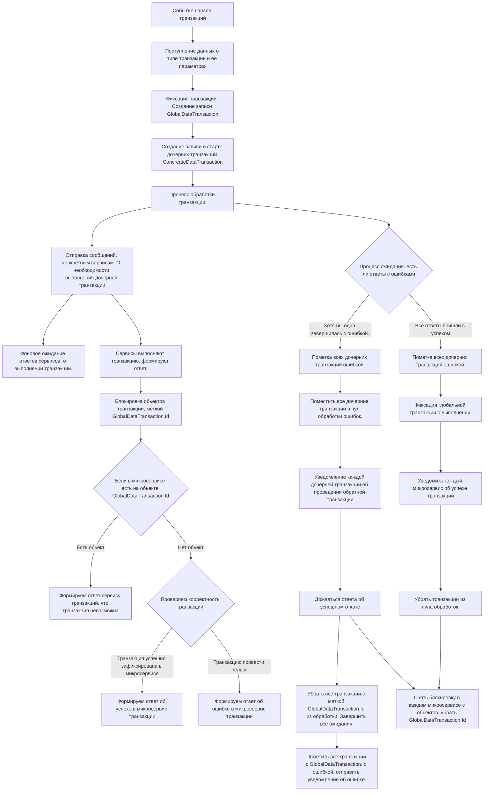

# Transaction Service

```mermaid
graph TD

A[Событие начала транзакций] -->B[Поступление данных о типе транзакции и ее параметрах]
B-->C[Фиксация транзакции. Создание записи GlobalDataTransaction]
C-->D[Создание записи о старте дочерних транзакций ConcreateDataTransaction]
D-->F[Процесс обработки транзакции.]
F-->FF[Отправка сообщений, конкретным сервисам. О необходимости выполнения дочерней транзакции]
F-->G{Процесс ожидания. есть ли ответы с ошибками }
FF-->FFF[Фоновое ожидание ответов сервисов, о выполнении транзакции. ]
FF-->T[Сервисы выполняют транзакцию, формируют ответ.]
T-->TT[Блокировка обьектов транзакции, меткой GlobalDataTransaction.Id]
TT-->TTT{Если в микросервисе есть на обьекте GlobalDataTransaction.Id}
TTT-->|Есть обьект| TTTY[Формируем ответ сервису транзакций, что транзакция невозможна]
TTT-->|Нет обьект| TTTN{Проверяем корректность транзакции.}
TTTN--> |Транзакция успешно зафиксирована в микросервисе| TTTNY[Формируем ответ об успехе в микросервис транзакции]
TTTN--> |Транзакцию провести нельзя| TTTNN[Формируем ответ об ошибке в микросервис транзакции]
G--> |Хотя бы одна завершилась с ошибкой.| GN[Пометка всех дочерних транзакций ошибкой.]
GN-->GNO[Поместить все дочерние транзакции в пул обработки ошибок. ]
GNO--> GNOG[Уведомление каждой дочерней транзакции об проведении обратной транзакции]
GNOG--> GNOGO[Дождаться ответа об успешном откате]
GNOGO-->GNOGOG[Убрать все транзакции с меткой GlobalDataTransaction.Id из обработки. Завершить все ожидания.]
GNOGOG-->GNOGOGG[Пометить все транзакции с GlobalDataTransaction.Id ошибкой, отправить уведомление об ошибке. ] 
GNOGO-->DownBlock[Снять блокировку в каждом микросервисе с обьектов, убрать GlobalDataTransaction.Id]
G-->|Все ответы пришли с успехом| GY[Пометка всех дочерних транзакций ошибкой.]
GY --> GYG[Фиксация глобальной транзакции о выполнении.]
GYG --> GYGO[Уведомить каждый микросервис об успехе транзакции]
GYGO -->GYGOG[Убрать транзакции из пула обработок.]
GYGOG -->DownBlock
```