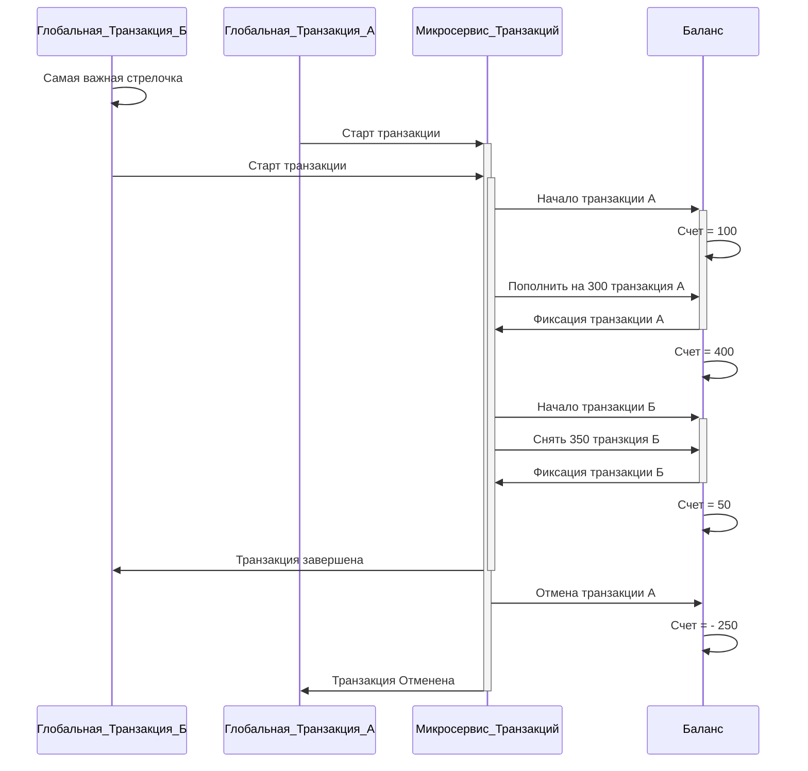
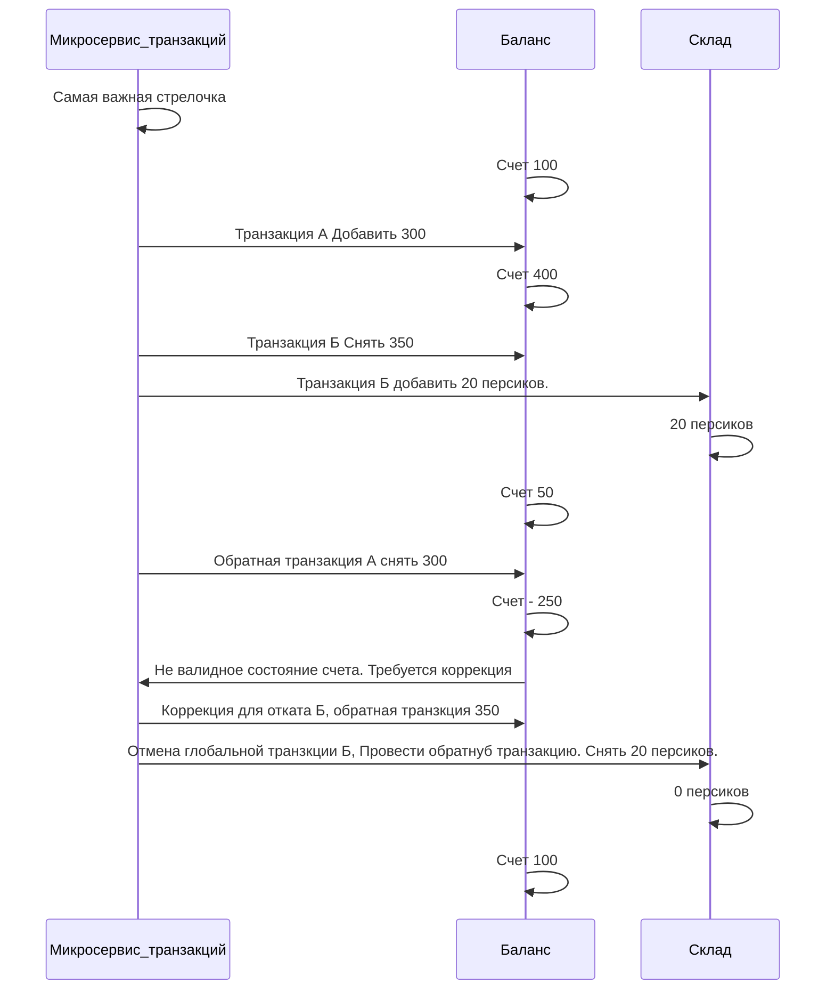


# Context: 
Миксервис контролирующий целостность транзакций. 

# Decision

решение было переведено на патерн  SAGA

## Проблема

Проблема обозначенная в диаграмме, показывает, что без глобальной фиксации транзакции и блокировок. 
у нас может возникнуть не однозначная ситуация не валидных отмененных транзакций. 

## Решение

В патерне SAGA откат дочерних транзакций, происходит отправкой обратных транзакций. 

Если пополнили счет на 300, то обратная транзакция снимает 300. 

Решение заключается в формировании транзакционных списков на каждый отдельный обьект, по которому будет проводиться транзкция. 

Счет пользователя
{

	Пополнен счет на 500, IDтранзакции
	
	снять со счета  500 IDТранзакции
	
	Пополнили счет на 120, ID транзакции. 
	
	Пополнили счет на 80, ID транзакции
	
}

Такие таблицы будут хранить транзкции по принципу стека. 
последним пришел, первым ушел. 

Обратные транзакции, удаляют запись о транзакции из таблицы. 

В случаи если Глобальная транзакция не может быть зафиксированна, проводится обратная транзакция для всех дочерних транзакций. 

В случаи, если обратная транзакция создает не валидное состояние обьекта, например отрицательный счет, или товара на складе. 

В таком случаи, мы из таблицы транзакции по ID Обьекта, берем значение из стека, и первую попавшуюся транзакцию помечаем на проведение обратной транзакции. 

Такое будет проводиться по порядку, пока не будет востанновлена валидность счета, или другого обьекта. 

Если мы помечаем обратную транзакцию из стека, то мы ищем всю глобальную транзакцию, к которой она принадлежит, и так же проводим откат операции.

Проверка на валидность будет проходить в каждом микросервисе, при каждой транзакции. 
 

## Общая структура решения

Микросервису баланса, и склада(Где будут хранится товары для торговли) рекомендуется хранить Id локальной транзакции. 
И ее вид операции, чтобы избежать повторной проводки. 

Примерная структура базы данных

PoolBalanceTransact 
{
	ID транзакции 
	
	ID Глобальной транзакции 
	
	Значение 
	
	дата
	
	Id счета
	
	bool выполнен
	
	Bool отменен
	
}

PoolProductTransact 
{
	ID транзакции 
	
	ID Глобальной транзакции 
	
	Значение 
	
	дата
	
	Id склада
	
	bool выполнен
	
	Bool отменен
	
}

глобальная транзакция 
{
	Id транзакции 
	
	Значение
	
	Дата
	
	IsComplite
	
	IsError
}

## События 

### консюмер 

ClosingOrder
{
	double sum,
	
	int countProduct,
	
	string idProduct,
	
	string idOrder,
	
	string idUserBuyer,
	
	string idUserSeller,
	
}

AbortingTransaction
{
	string idGlobalTransact
	
	string idTransact
	
	string source
	
}

CompletedTransaction
{
	string idGlobalTransact
	
	string idTransact
	
	string source
	
}

NotValidStatus
{

	string source
	
}

### Продюсер 

BalanceTransact
{
	string idGlobalTransact,
	
	string idTransact,
	
	string idOrder,
	
	string idUser,
	
	double sum,
	
	bool isAdd,
	
	bool isReverse
	
}

ProductTransact
{
	string idGlobalTransact,
	
	string idTransact,
	
	string idOProduct,
	
	string idUser,
	
	string idOrder,
	
	int count,
	
	bool isAdd,
	
	bool isReverse
	
}

# Status

Предложено