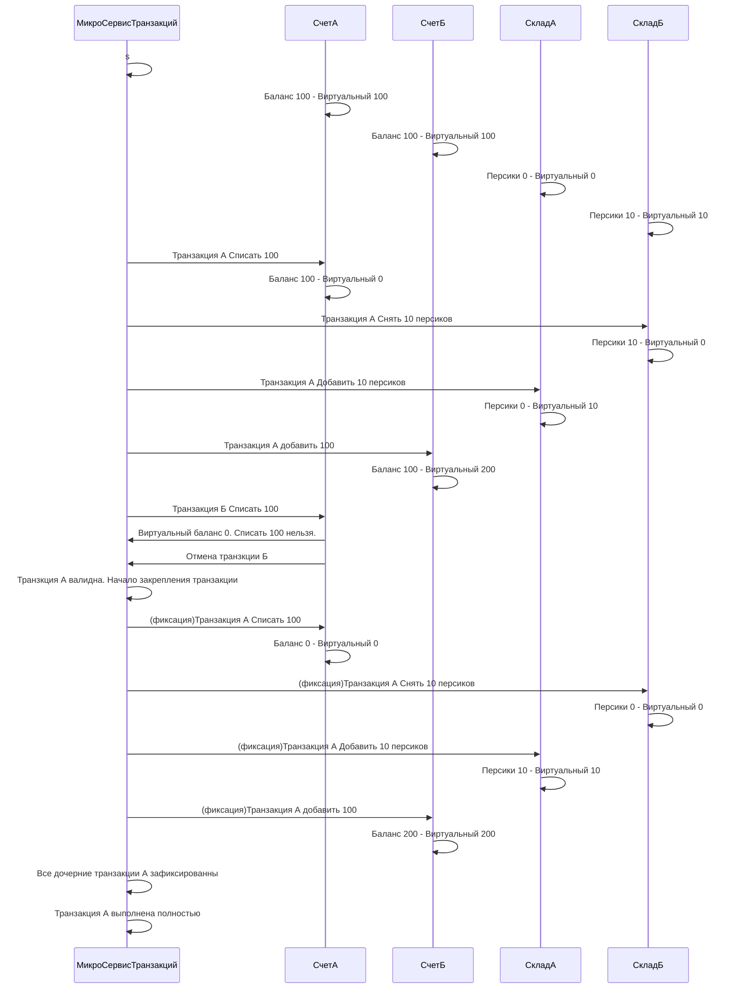


# Context: 
Миксервис контролирующий целостность транзакций. 

# Decision

решение третье. Добавлен виртуальный счет, последовательность проводок. 
блокировки на основе виртуального счета. 



Работает в данный момент следующим образом. 

Есть разделение счета/складов/других вариантов на Текущие значение счета, и виртуального. 

Это нужно чтобы создать частичные блокироки на транзакции, которые будут учитывать последовательность, не завершенных блокировок. 

Чтобы избежать ситуации, когда отмена транзакции, или последовательность транзакций, приведут счет в не валидное состояние. 

## Проблема

Проблема заключается в том, где хранить состояние виртуального счета. 
Чья это ответственность. 

## Решение

Весь учет виртуальных данных, и блокировок вынести в микросервис транзакций. 

Перенос учета виртуальных данных на сервис транзакции, позволит вести учет с дополнительными измерениями, необходимые для контроля целостности самих транзакций. 

Так же это позволит убрать со всех сервисов ответственность за валидацию, и поэтапную проверку. оставляя только прямые обязанности в пополнии баланса/списания 
или аналогичных для других сервисов. 

Из плюсов так же, возможное использование средств транзкций mongoDB когда то в будущем. по нескольким документам. 


## Общая структура решения

Микросервису баланса, и склада(Где будут хранится товары для торговли) рекомендуется хранить Id локальной транзакции. 
И ее вид операции, чтобы избежать повторной проводки. 

Примерная структура базы данных
```proto
BalanceValue
{

	string idObject
	Decimal virtual 
	Decimal summ 
	[]BalanceTransact 
	{

		ID транзакции 
		
		ID Глобальной транзакции 
		
		Значение 
		
		дата
		
		Id счета
		
		bool выполнен
		
		Bool отменен
		
	}
}


OrderValue
{

	string idObject
	int virtual 
	int quanity  
	[]OrderTransact 
	{

		ID транзакции 
		
		ID Глобальной транзакции 
		
		Значение 
		
		дата
		
		Id склада
		
		bool выполнен
		
		Bool отменен
		
	}
}


глобальная транзакция 
{

	Id транзакции 
	
	Значение
	
	Дата
	
	IsComplite
	
	IsError
}
```
## События 

### Входящие события 

```proto
BalanceReplenished 
{

	DecimalValue sum,
	
	string id_user_buyer
	
}

OrderClosing
{

	DecimalValue sum,
	
	int count_product,
	
	string id_product,
	
	string id_order,
	
	string id_user_buyer,
	
	string id_user_seller,
	
}

TransactionCanceled
{

	string id_global_transact
	
	string id_transact
	
	string source
	
}

TransactionCompleted
{

	string id_global_transact
	
	string id_transact
	
	string source
	
	string id_object
	
	DecimalValue quanity
	
}
```

TransactionCompleted принимает Id обьекта, счета/элемента заявки

и количество 

### Исходящие события 

```proto
BalanceChanged
{

	string id_global_transact,
	
	string id_transact,
	
	string id_order,
	
	string id_user,
	
	double sum,
	
	bool is_add,
	
	bool is_reverse
	
}

ProductChanged
{

	string id_global_transact,
	
	string id_transact,
	
	string id_product,
	
	string id_user,
	
	string id_order,
	
	int count,
	
	bool is_add,
	
	bool is_reverse
	
}
```

# Status

Предложено