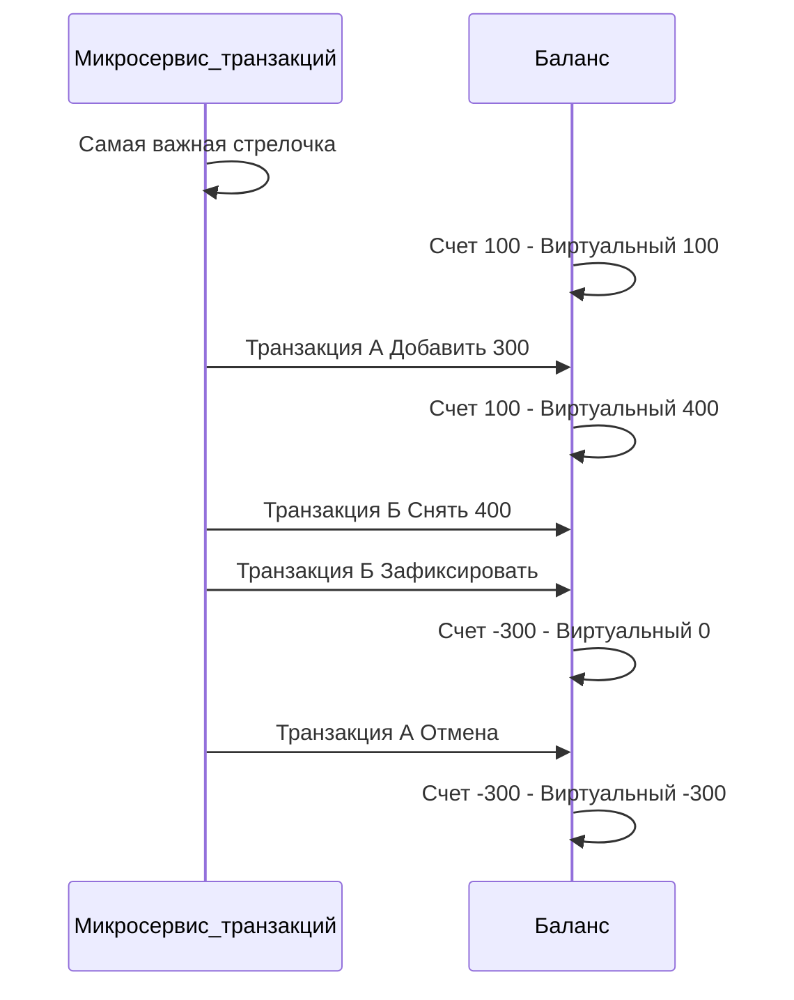
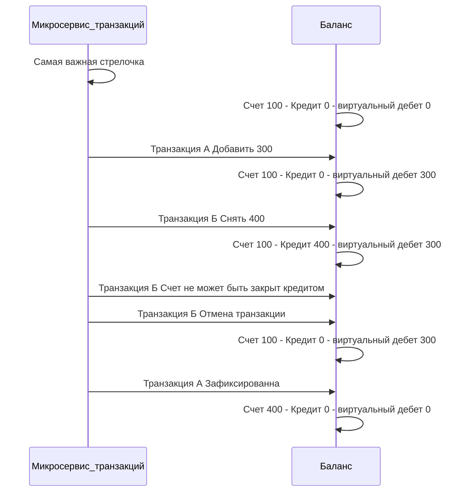
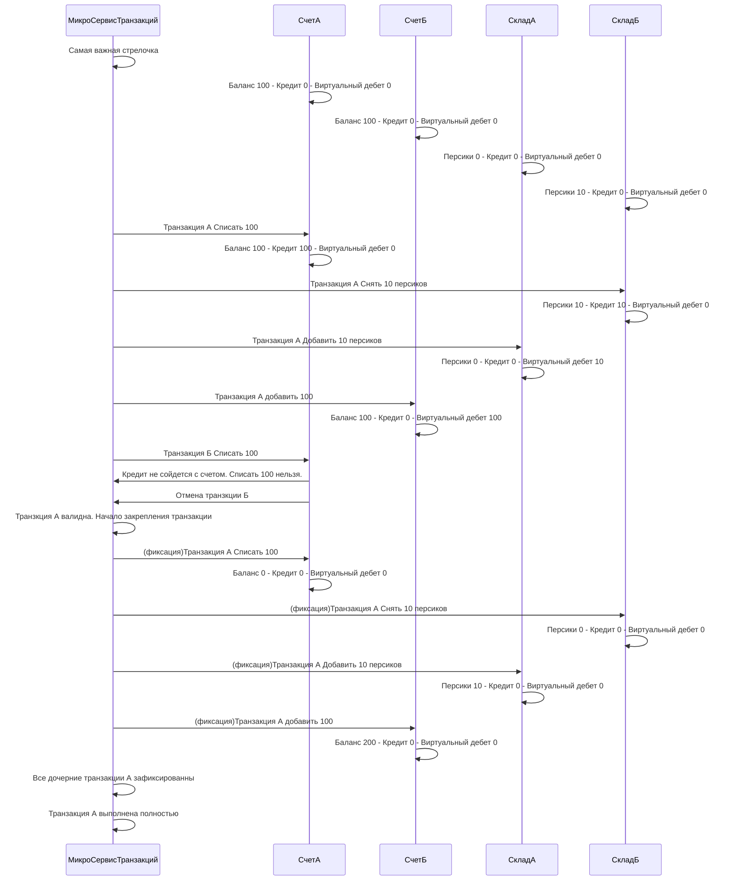


# Context: 
Миксервис контролирующий целостность транзакций. 

# Decision

решение Четвертое. Переделана система виртуального счета. 


# Проблема. 


В данный момент Виртуальный счет может попасть в проблему. Когда мы отображаем в виртуальном счете транзакции пополнения. 

# решение. 

Пополнение счета, само по себе, не может привести систему в не валидное состояние. 

По этому я считаю, что транзакции пополнения, не нужно отображать в виртуальном счете. 

Для транзакций снятия баланса, ситуация обратная. Там важен порядок и партии, чтобы быть уверенными, что виртуальный счет, сможет закрыться в нормальный. 

Предположительно это будет система дебета и кредита из бухгалтерского учета. 
где дебет, текущий счет на руках. А кредит это будущие траты 

p.s да это упрощенная форма бух учета, ибо так работают не все счета. 


# краткая реализация решения



Работает в данный момент следующим образом. 

Есть разделение счета/складов/других вариантов на Текущие значение счета, и Кредита, и виртуального дебета. 

Счет это значение зафиксированных данных транзакциями. Кредит это не зафиксированные данные списания. Виртуальный дебет, это не зафиксированные данные пополнения баланса. 

Это нужно чтобы создать частичные блокироки на транзакции, которые будут учитывать последовательность, не завершенных блокировок. 

Чтобы избежать ситуации, когда отмена транзакции, или последовательность транзакций, приведут счет в не валидное состояние. 

## Проблема

Проблема заключается в том, где хранить состояние виртуального счета. 
Чья это ответственность. 

## Решение

Весь учет виртуальных данных, и блокировок вынести в микросервис транзакций. 

Перенос учета виртуальных данных на сервис транзакции, позволит вести учет с дополнительными измерениями, необходимые для контроля целостности самих транзакций. 

Так же это позволит убрать со всех сервисов ответственность за валидацию, и поэтапную проверку. оставляя только прямые обязанности в пополнии баланса/списания 
или аналогичных для других сервисов. 

Из плюсов так же, возможное использование средств транзкций mongoDB когда то в будущем. по нескольким документам. 


## Общая структура решения

Микросервису баланса, и склада(Где будут хранится товары для торговли) рекомендуется хранить Id транзакции. 
И ее вид операции, чтобы избежать повторной проводки. 

Примерная структура базы данных


```proto
BalanceValue
{

	string idObject
	Decimal credit
	Decimal virtualDebit 
	Decimal summ 
	string lastIdTransact 
}
BalanceTransact 
{

	ID Глобальной транзакции 
	
	Значение 
	
	дата
	
	Id счета
	
	string status 
	
}

OrderValue
{

	string idObject
	int credit
	int virtualDebit 
	int quanity  
	string lastIdTransact 
}

OrderTransact 
{

	ID Глобальной транзакции 
	
	Значение 
	
	дата
	
	Id склада
	
	string status
	
}

глобальная транзакция 
{

	Id транзакции 
	
	Значение
	
	Дата
	
	string status
}
```
## События 

### Входящие события 

```proto
BalanceReplenished 
{

	DecimalValue sum,
	
	string id_user_buyer
	
}

OrderClosed
{

	DecimalValue sum,
	
	int count_product,
	
	string id_product,
	
	string id_order,
	
	string id_user_buyer,
	
	string id_user_seller,
	
}

TransactionCanceled
{

	string id_global_transact
	
	SourceEventTransaction SOURCE
	
}

TransactionCompleted
{

	string id_global_transact
	
	SourceEventTransaction SOURCE
	
	string id_object
	
	DecimalValue quanity
	
}
```

TransactionCompleted принимает Id обьекта, счета/элемента заявки

и количество 

### Исходящие события 

```proto
TransactionBalanceCommitted
{

	string id_global_transact,

	string id_order,
	
	string id_user,
	
	DecimalValue sum,
	
	Operation MODE,
	
	TransactionType TYPE
	
}

TransactionProductCommitted
{

	string id_global_transact,
	
	string id_product,
	
	string id_user,
	
	string id_order,
	
	int count,
	
	Operation MODE,
	
	TransactionType TYPE
	
}
```

## 

```proto
message DecimalValue
{
	// The whole units of the amount.
	int64 units = 1;
	// Number of nano (10^-9) units of the amount.
	// The value must be between -999,999,999 and +999,999,999 inclusive.
	// If `units` is positive, `nanos` must be positive or zero.
	// If `units` is zero, `nanos` can be positive, zero, or negative.
	// If `units` is negative, `nanos` must be negative or zero.
	// For example $-1.75 is represented as `units`=-1 and `nanos`=-750,000,000.
	int32 nanos = 2;
}
```
```proto
enum Operation {
	// Операция добавления 
	ADDITION = 0;
	// Операция вычитания  
	SUBTRACT = 1;
}
```
```proto
enum TransactionType {
	// Операция проводки транзакции 
	ACTION  = 0;
	// Операция отката транзакции 
	ROLLBACK = 1;
}
```

```proto
enum SourceEventTransaction {
	PRODUCT_ORDER_ADDITION_ACTION = 0;
	PRODUCT_ORDER_SUBTRACT_ACTION = 1;
	
	BALANCE_ADDITION_IMMEDIATE = 2;
	BALANCE_SUBTRACT_IMMEDIATE = 3;
	
	PRODUCT_ORDER_ADDITION_ROLLBACK = 4;
	PRODUCT_ORDER_SUBTRACT_ROLLBACK = 5;
	
	BALANCE_ADDITION_ROLLBACK = 6;
	BALANCE_SUBTRACT_ROLLBACK = 7;
	
	PRODUCT_BRIEFCASE_ADDITION_ROLLBACK = 8;
	PRODUCT_BRIEFCASE_SUBTRACT_ROLLBACK = 9;
	
	PRODUCT_BRIEFCASE_ADDITION_IMMEDIATE = 10;
	PRODUCT_BRIEFCASE_SUBTRACT_IMMEDIATE = 11;
}
```


# Status

Предложено