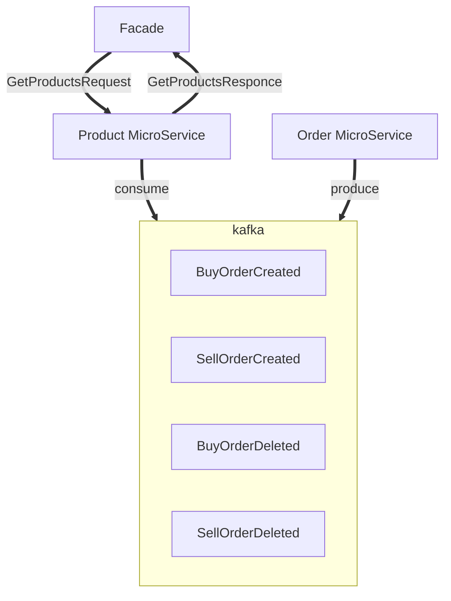

adr by ted7007

Статус:  
 * Предложено

Проблема:  

Мироксервис с товарами доступных для торговли. 
Метод в микросервисе на получение списка товаров доступных для торговли.

Требования:  
Получение клиентом списка продуктов для торговли, каждый из которых будет содержать  id, название, bid and ask  
[Секция с требованиями](https://docs.google.com/document/d/1NvxJDdTIB7qBqGpAQsgQmtSa3DbxsR0sPqAFgcczsjY/edit#heading=h.q61z6p80nw0e)


Решение:
 Основная задача, модель товара.  
Небходимо рассмотреть взаимодействие микросервиса с кафкой - сообщения, негативные сценарии, ошибки между сервисами
Также стоит вопрос о модели товара, взаимодействии сервиса товара с mongoDB


Схема взаимодействия:  



Модель товара:  
```csharp
{
	[BSON.ObjectID]
	string Id
	string Name 
	decimal Bid
	decimal Ask
}
```
	
Наш микросервис подписан на топик заявок, пусть будет BuyOrderCreated, SellOrderCreated, BuyOrderDeleted, SellOrderDeleted(смотря как это реализуется в микросервисе заявок) куда будут приходить события на создание новой заявки.  
Из этих событий будет формироваться база текущих заявок, из которой будут извлекаться данные о текущих ценах товаров.


Мною предлагается следующий процесс общения с кафкой используя proto:  
Микросервис товаров опрашивает топик на новые сообщения.  
Каждое полученное сообщение будет десериализовываться из байтовых значений в c#-objs используя десериализатор на основе proto событий заявок:  
 >Это предположительное определение сообщений, окончательный вариант должен быть предложен микросервисом заявок  
```proto
// Сообщение с данными созданной заявки на покупку
message BuyOrderCreated
{
	string id = 1
	string name = 2;
	int quanity = 3;
	DecimalValue price = 4;
}

// Сообщение с данными созданной заявки на продажу
message SellOrderCreated
{
	string id = 1
	string name = 2;
	int quanity = 3;
	DecimalValue price = 4;
}

// Сообщение с данными удаленной заявки на покупку
message BuyOrderDeleted
{
	string id = 1
}


// Сообщение с данными удаленной заявки на продажу
message SellOrderDeleted
{
	string id = 1
}
```  

```proto
message DecimalValue
{
	// The whole units of the amount.
	int64 units = 1;

	// Number of nano (10^-9) units of the amount.
	// The value must be between -999,999,999 and +999,999,999 inclusive.
	// If `units` is positive, `nanos` must be positive or zero.
	// If `units` is zero, `nanos` can be positive, zero, or negative.
	// If `units` is negative, `nanos` must be negative or zero.
	// For example $-1.75 is represented as `units`=-1 and `nanos`=-750,000,000.
	int32 nanos = 2;
}
```
	
для DecimalValue нужно создать расширение для простого конвертирования в decimal, подробнее [тут](https://visualrecode.com/blog/csharp-decimals-in-grpc/)  
Сообщения для общения с кафкой хранятся в общей библиотеке .proto файлов и подключаются по необходимости

---  

Проблема:  
Метод получения списка товаров для торговли в микросервисе товаров  

Решение:
Этот метод будет вызываться другим сервисом по grpc.  
Метод будет реализован в микросервисе товаров. Реализация будет происходить за счет данных о текущих заявках

```proto
service ProductService {
  rpc GetProducts(GetProductsRequest) returns(GetProductsResponse);
}

message GetProductsRequest
{

}

message GetProductsResponse
{
	repeated Product products = 1;
}

message Product
{
	string id = 1;

	string name = 2;

	DecimalValue bid = 3;

	DecimalValue ask = 4;
}
```  
Альтернативные вариант ответного сообщения с пагинацией:  
```proto
message GetProductsRequest
{
	// Максимальное кол-во объектов на странице
	int pages_size = 1;

	// Номер страницы
	int page_number = 2;
}

message GetProductsResponce
{
	repeated Product products = 1;

	// Номер следубщей страницы
	int next_page_number = 2;
}
```  

Контракт на общение service to service будет находиться в обрабатывающем микросервисе, его будет импортировать вызывающий сервис (в нашем случае facade)

---  

Статус:  
 * Предложено

Проблема:  
Получение списка товаров доступных для торговли фасадом

Требования:
Система выводит список товаров для продажи. Если система не может вывести список - система выводит сообщение об ошибке.
(Секция с требованиями)[https://docs.google.com/document/d/1NvxJDdTIB7qBqGpAQsgQmtSa3DbxsR0sPqAFgcczsjY/edit#heading=h.q61z6p80nw0e]

Решение:  
Проблема решается с помощью микросервиса фасада.
Метод получения списка будет использовать контракт микросервиса заявок GetProductsWithBidAndAsk, делая на него запрос GetProductsRequest 
и ожидая ответ GetProductsResponce.  
Метод будет также отлавливать ошибку RpcException, если такая будет - фасад должен оповестить клиента о ошибке и попросить обновить страницу.
