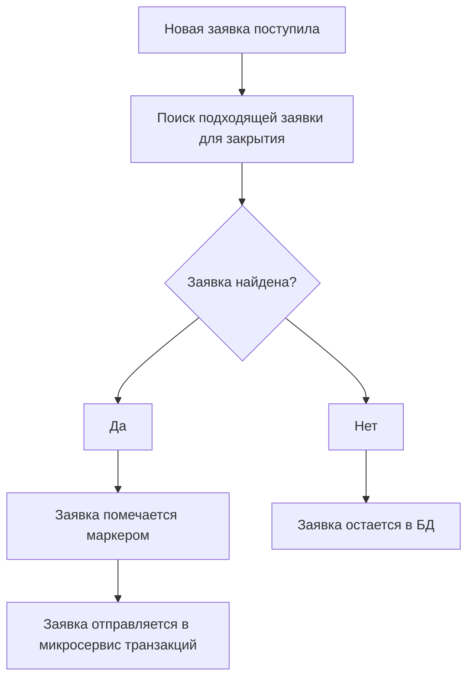

### Context

Микросервис, реализующий механизм выставления заявок. 

ссылка на требования:  
https://docs.google.com/document/d/1NvxJDdTIB7qBqGpAQsgQmtSa3DbxsR0sPqAFgcczsjY/edit#heading=h.h3k0b09pdfj1   

---

### Status 

Предложено

---

### Decision

Приблизительный принцип работы микросервиса:  
\- Создание заявки. Facade делает первичную валидацию, что заявку выставить возможно, после чего отправляет сообщение в Микросервис. На основе данных формируется заявка и сохраняется. Далее микросервис ищет подходящие заявки, находит, отправляет данные в микросервис транзакций. Если не находит, то заявка остается лежать в БД. Микросервис транзакций проделывает необходимые операции, после чего заявки либо закрываются, либо обновляются( если закрыт не весь объем ), либо остаются нетронутыми.

Процесс поиска подходящих заявок:


Для избежания попадания заявки, которая уже находится в транзакции, в другую транзакцию необходимо ввести дополнительный маркер указывающий, что данную заявку обрабатывать нельзя. Например bool "in_transaction" или id транзакции.


БД микросервиса:
Коллекция для заявок на покупку:
```
// В качестве индекса UserID
[6bf280fe-fa36-4fde-a69e-434cc76d45ae] 
{
   "in_transaction" : false
   "order_id" : "91d6bbdf-6388-4da9-9991-9c92e8b751f7",
   "type" : 1,
   "product_id" : "b5a7c6d8-3533-4d45-97ba-500f202b9077",
   "quantity" : 3232,
   "price" : 123.00,
}
```

Также будет коллекция для завершенных заявок.

---


### .proto

Так как Proto не поддерживает Decimal, определяем свой:  
https://docs.microsoft.com/ru-ru/dotnet/architecture/grpc-for-wcf-developers/protobuf-data-types  
https://visualrecode.com/blog/csharp-decimals-in-grpc/

```proto
message DecimalValue {
  int64 units = 1;
  sfixed32 nanos = 2;
}
```

```proto
enum OrderType {
   SELL_ORDER = 1;
   BUY_ORDER = 2;
}
```

### Kafka

```proto   
// Сообщение приходит от Facade. На основе полей формируется заявка и сохраняется в БД.
message OrderCreatedEvent {
  string user_id = 1;
  
  // Тип заявки
  OrderType type = 2;
  string product_id = 3;
  DecimalValue price = 4;
  int32 quantity = 5;   
}
```  


```proto  
// Сообщение для микросервиса транзакций.
// На это событие подписан микросервис транзакций.
message OrderCandidateOccurredEvent {
   string order_id = 1;
   string order_id_seller = 2;
   int32 quantity = 3;
   string product_id = 4;
   string user_id_buyer = 5;
   string user_id_seller = 6;
   DecimalValue price = 7;
}
```

```proto
// Ответ от микросервиса транзакций
message OrderCandidateOccurredProcessFailed {
   string order_id = 1;
   string order_id_seller = 2;
}
```

```proto
// Ответ от микросервиса транзакций
message OrderCandidateProcessSuccess {
   string order_id = 1;
   string order_id_seller = 2;
}
```

