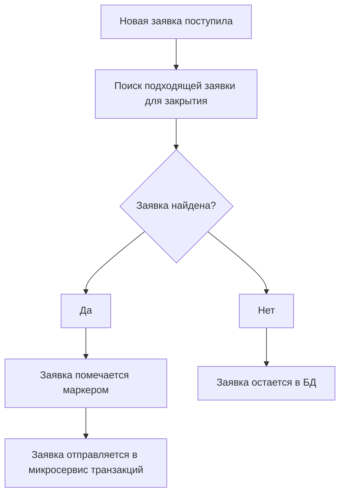

### Context

Микросервис, реализующий механизм выставления заявок. 

ссылка на требования:  
https://docs.google.com/document/d/1NvxJDdTIB7qBqGpAQsgQmtSa3DbxsR0sPqAFgcczsjY/edit#heading=h.h3k0b09pdfj1   

---

### Status 

Предложено

---

### Decision

Приблизительный принцип работы микросервиса:  
Facade делает первичную валидацию, что заявку выставить возможно, после чего отправляет сообщение в Микросервис. На основе данных формируется заявка и сохраняется. Далее микросервис ищет подходящие заявки, находит, отправляет данные в микросервис транзакций. Если не находит, то заявка остается лежать в БД. Микросервис транзакций проделывает необходимые операции, после чего заявки либо закрываются, либо обновляются( если закрыт не весь объем ), либо остаются нетронутыми.

Процесс поиска подходящих заявок:


Для избежания попадания заявки, которая уже находится в транзакции, в другую транзакцию необходимо ввести дополнительный маркер указывающий, что данную заявку обрабатывать нельзя. Например bool "in_transaction" или id транзакции.


БД микросервиса:
Коллекция для заявок на покупку:
```
// В качестве индекса UserID
[6bf280fe-fa36-4fde-a69e-434cc76d45ae] 
{
   "in_transaction" : false,
   "order_id" : "6ff5a871-1008-414d-9803-5a8f7fb8ac31",
}
```

Также будет коллекция для завершенных заявок.

```
// В качестве индекса UserId 
[b0f2e904-962f-493c-9b2e-87fd270e2e11]
{
   "order_id" : "674b4ea1-133a-4569-887a-cbc0529b2340",
   "order_id_second" : "caca7473-03c5-41bc-8228-fe4d833ae0af",
   "user_id_second" : "67f9341f-b328-4d22-b735-3e52951b907c",
}
```

Коллекция, которая в основном служит для генерация order_id:

```
// В качестве индекса OrderId
[fb3a2347-d50a-4ca7-8348-97230710302d]
{
   "type" : 1,
   "product_id" : "6ff5a871-1008-414d-9803-5a8f7fb8ac31",
   "quantity" : 2343,
   "price" : 900
}
```

---


### .proto

Так как Proto не поддерживает Decimal, определяем свой:  
https://docs.microsoft.com/ru-ru/dotnet/architecture/grpc-for-wcf-developers/protobuf-data-types  
https://visualrecode.com/blog/csharp-decimals-in-grpc/

```proto
message DecimalValue {
  int64 units = 1;
  sfixed32 nanos = 2;
}
```

```proto   
// Тип заявки.
enum OrderType {
   SELL_ORDER = 1;
   BUY_ORDER = 2;
}
```

```proto
enum Error {
   // Пользователь с таким Id не был найден. 
	USER_NOT_FOUND = 1;
	// Пользователь не имеет продукт с таким Id.  
	USER_NOT_HAVE_PRODUCT = 2;
	// Пользователь не имеет необходимое количества продукта. 
	USER_NOT_HAVE_QUANTITY_PRODUCT = 3;
}
```

```proto
message SuccessResponse {

}
```


### Создание заявки. | gRPC

```proto
service OrderProcessing {
   rpc CreateOrder (CreateOrderRequest) returns (CreateOrderResponse)
}
```


```proto   
// Сообщение приходит от Facade. На основе полей формируется заявка.
message CreateOrderRequest {
  string user_id = 1;
  OrderType type = 2;
  string product_id = 3;
  DecimalValue price = 4;
  int32 quantity = 5;   
}
```  

```proto
message CreateOrderResponse {
   oneof result {
      Error error = 1;
      SuccessResponse = 2;
   }
}
```


---

### Закрытие заявки. | Kafka

```proto  
// Сообщение для микросервиса транзакций.
// На это событие подписан микросервис транзакций.
message OrderCandidateOccurredEvent {
   string order_id = 1;
   string order_id_seller = 2;
   int32 quantity = 3;
   string product_id = 4;
   string user_id_buyer = 5;
   string user_id_seller = 6;
   DecimalValue price = 7;
}
```

```proto
// Ответ от микросервиса транзакций
message OrderCandidateOccurredProcessFailed {
   string order_id = 1;
   string order_id_seller = 2;
}
```

```proto
// Ответ от микросервиса транзакций
message OrderCandidateProcessSuccess {
   string order_id = 1;
   string order_id_seller = 2;
}
```

---


### Удаление недействительных заявок. | Kafka

Микросервис заявок подписан на события изменения/удаления товара в портфеле. 

```proto
// Это сообщение отправляется из микросервиса портфеля, когда у пользователя отнимается   
// некоторое количество товара после факта продажи. На это событие должен быть   
// подписан Микросервис заявок. Он ищет заявку в БД по Type = "sell_order" по user_id,   
// а далее по product_id. Если в заявке указанное количество больше, чем quantity,  
// то заявку необходимо отменить, так как она недействительна.
message ProductSoldEvent {   
   // Для защиты от дубликатов.
   string order_id = 1;   
   string user_id = 2;
   string product_id = 3;
   int32 quantity = 4;
}
```

```proto
// Это сообщение отправляется из микросервиса портфеля, когда пользователь  
// удаляет свой товар из портфеля активов. На это событие подписан Микросервис Заявок. 
message ProductRemovedEvent {
   string user_id = 1;
   string product_id = 2;
}
```

---
